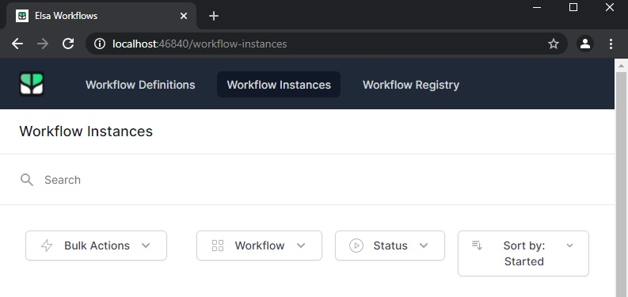

This example is taken [from here](https://elsa-workflows.github.io/elsa-core/docs/next/guides/guides-document-approval).

The workflow for this case is not built via UI. Its built in the code. 

Mail hog is needed to be setup as smtp host.

The workflow instance is created and the execution is kicked off when we send a post request as described [here](https://elsa-workflows.github.io/elsa-core/docs/next/guides/guides-document-approval#first-run).

This has no ui mvc pages other than the _Host.cshtml. But the significance is that we can see the executed instances in the ui.

