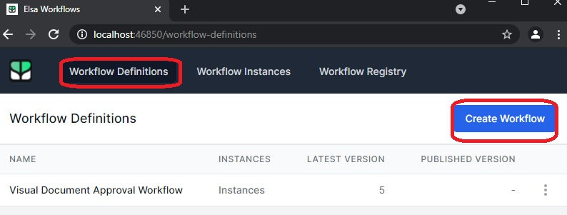
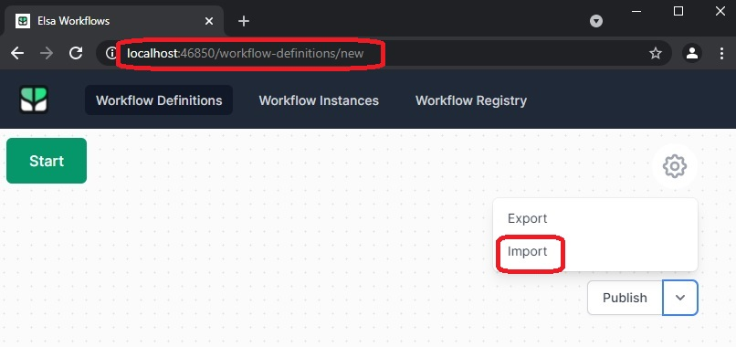
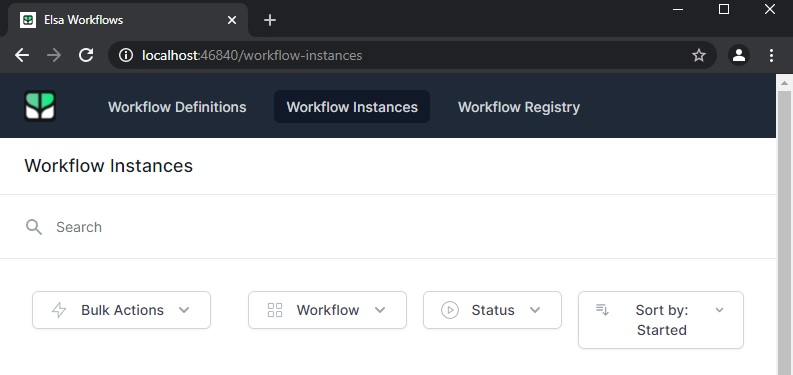

This example is taken [from here](https://elsa-workflows.github.io/elsa-core/docs/next/guides/guides-document-approval).

The Json document "workflow-definition-visual-document-approval-workflow.json" is attached in the project.

This can be used to create an instance.

Click Workflow definitions, then create new button. Then use import at the botton right.

Mail hog is needed to be setup as smtp host.

The workflow instance is created and the execution is kicked off when we send a post request as described [here](https://elsa-workflows.github.io/elsa-core/docs/next/guides/guides-document-approval#first-run).

This has no ui mvc pages other than the _Host.cshtml. But the significance is that we can see the executed instances in the ui.

